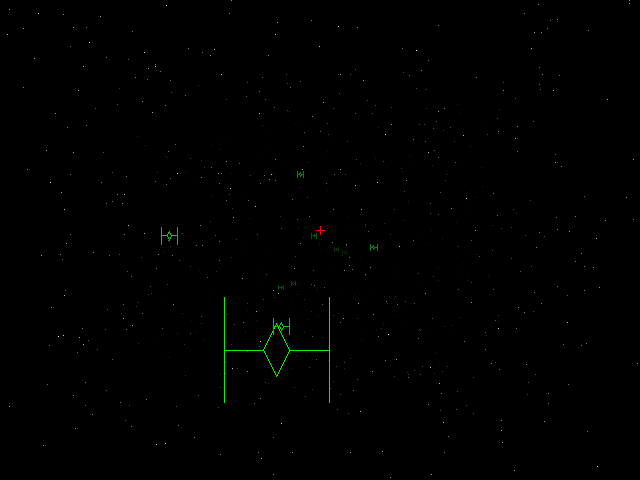

# 3D Software Game

A small 3D software game (use perspective projection). Only lines and dots are used for drawing.

## Build

The game use SDL for rendering.

```
$ apt-get install libsdl1.2-dev
```


```
$ make -C src
```

## Usage and run

ARROWS to move a cross.

SPACE to shoot.

W to increase star field speed

S to decrease star field speed.

ESC to stop the game loop.

```
$ ./game
```



